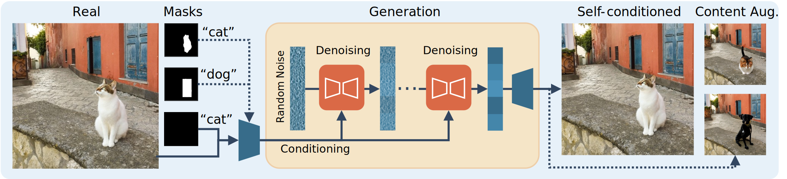
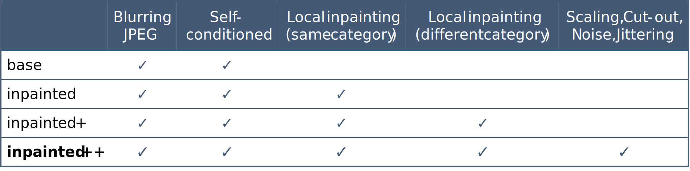
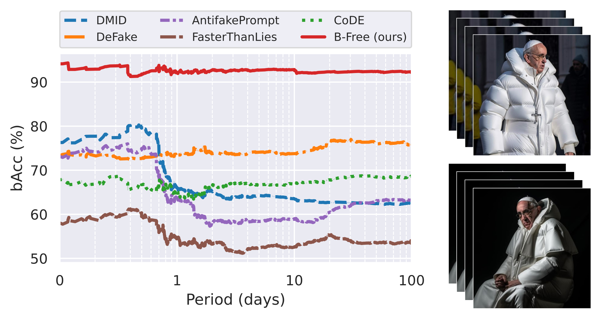
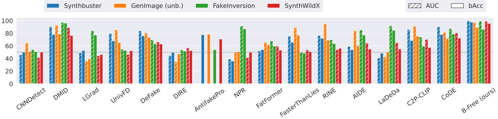
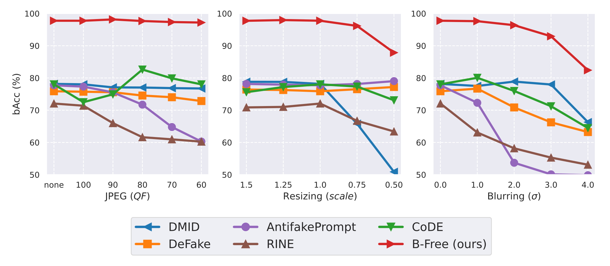

[](https://grip-unina.github.io/BFree)
[](https://arxiv.org/abs/2412.17671)
<a href="https://www.grip.unina.it">
  
</a>


## Overview

<center>
 
</center>

A well-designed forensic detector should detect generator specific artifacts rather than reflect data biases. 
To this end, we propose **B-Free**, a bias-free training paradigm for AI-generated image detection, where fake images are generated from real ones using 
the conditioning procedure of stable diffusion models. 
This ensures semantic alignment between real and fake images, allowing any differences to stem solely from the subtle 
artifacts introduced by AI generation. 
Through **content-based augmentation**, we show significant improvements in both generalization and robustness over 
state-of-the-art detectors and more calibrated results.

## Training Paradigm

To avoid possible biases, we generate synthetic images from self-conditioned reconstructions of real images and include 
augmentation in the form of inpainted versions.
To ensure fake images semantically match the content of real images, we exploit the conditioning mechanism of Stable
Diffusion 2.1. More specifically:
* For **self-conditioning**, we use an empty mask (all zeroes) to induce the diffusion steps to regenerate the input.
* For the **content augmentation**, we use an object mask to replace an object with a new one of same category, or a 
rectangular mask to replace it with a new one of a different category.

<center>  </center>

Besides the default inpainting, which regenerates the whole image, we consider also a version where the original 
background is restored (figure above).

## Architecture

We adopt a variant of the ViT network proposed in [[1]](https://arxiv.org/abs/2309.16588) with four registers and use the 
pretraining based on DINOv2 [[2]](https://arxiv.org/abs/2304.07193). During training, we avoid resizing the image and rely 
on large crops of 504 × 504 pixels. At inference time, we extract crops of 504 × 504 pixels (if the image is larger we 
average the results of multiple crops).\
The official python implementation of this architecture is found [here](https://github.com/facebookresearch/dinov2).

[[1]](https://arxiv.org/abs/2309.16588) *Timothée Darcet et al., Vision Transformers Need Registers. (ICLR 2024)* \
[[2]](https://arxiv.org/abs/2304.07193) *Maxime Oquab et al., DINOv2: Learning Robust Visual Features without Supervision. (TMLR 2024)*

## Augmentation strategies

<center>  </center>

Our approach adopts the *inpainted++* strategy, which includes self-conditioned images, content augmentation (local 
inpainting), blurring, JPEG compression, scaling, cut-out, noise, and jittering.

## Training set

You can download our training dataset here (*coming soon*).

***Note:*** *training a method on this dataset only partially reflects the **inpainted+** version of our augmentation 
strategy, as the dataset does not include blurring, JPEG, and the extra augmentations of **inpainted++** (scaling, 
cut-out, noise addition, jittering), which are performed at training time.*

|        | Real   | Generated |
|--------|:------:|:---------:|
| Source | COCO   | SD 2.1    |
| Num.   | 51,517 | 309,102   |  

To create this dataset we used images collected from the training set of MS-COCO dataset (discarding images with 
licenses different than Creative Commons) and images generated with Stable Diffusion 2.1.\
Specifically, we first extracted the largest central crop and resize it to 512 x 512.
Then, for the generations, we used the inpainting code from the official [Stable Diffusion 2.1 repository](https://github.com/Stability-AI/stablediffusion).
Note that we did NOT embed the watermark during generation (`put_watermark` function).

Further details can be found in appendix A of the paper.


## Dataset of viral images

You can download our dataset of viral images here (*coming soon*).\
It comprises real and fake images that went viral on internet and includes multiple web-scraped versions of
each image, for a total of about 1400 images.

<center>  </center>

The figure shows the performance in terms of balanced accuracy evaluated evaluated over a 100-day period from 
the time of initial online post (Log scale). \
The performance drops after only one day, after which most competitors are stuck below 70%. Only B-Free is
able to ensure an average accuracy around 92% even after many days from the first on-line post.


## Other results

<figure style="text-align: center;">
  
  <figcaption style="font-size: 0.9em; margin-top: 8px;">
    Average performance in term of AUC and bAcc on four datasets: Synthbuster, GenImage, FakeInversion, SynthWildX.
  </figcaption>
</figure>

Some methods, like NPR and LGrad, present a clear non-uniform behavior, with very good performance on a single dataset 
and much worse on the others. This seems to suggest that these methods may not be truly detecting forensic artifacts, 
instead are rather exploiting intrinsic biases within the dataset. Differently, the proposed method presents a uniform 
performance across all datasets and a small loss between AUC and accuracy.

<figure style="text-align: center;">
  
  <figcaption style="font-size: 0.9em; margin-top: 8px;">
    Robustness analysis in terms of balanced Accuracy carried out on nine generators of Synthbuster under three different
    post-processing operations: JPEG compression, resizing and blurring.
  </figcaption>
</figure>

Robustness analysis in terms of balanced Accuracy carried out on nine generators of Synthbuster under three different
post-processing operations: JPEG compression, resizing and blurring. 
B-Free is more robust by a large margin compared with other methods and can ensure a balanced accuracy always above 80%
even in the most challenging scenario.

## News
*   TODO: release code
*   TODO: release viral images dataset
*   TODO: release training data
*   2025-04-03: Updated arXiv version!
*   2024-12-23: Paper has been uploaded on arXiv


## Bibtex

 ```
@article{Guillaro2024biasfree,
      title={A Bias-Free Training Paradigm for More General AI-generated Image Detection}, 
      author={Guillaro, Fabrizio and Zingarini, Giada and Usman, Ben and Sud, Avneesh and Cozzolino, Davide and Verdoliva, Luisa},
      year={2024},
      journal={arXiv preprint arXiv:2412.17671},
      url={https://arxiv.org/abs/2412.17671}, 
}
```

## Acknowledgments

We gratefully acknowledge the support of this research by a Google Gift. In addition, this work has received funding 
from the European Union under the Horizon Europe vera.ai project, Grant Agreement number 101070093, and was partially 
supported by SERICS (PE00000014) under the MUR National Recovery and Resilience Plan, funded by the European Union - 
NextGenerationEU.


